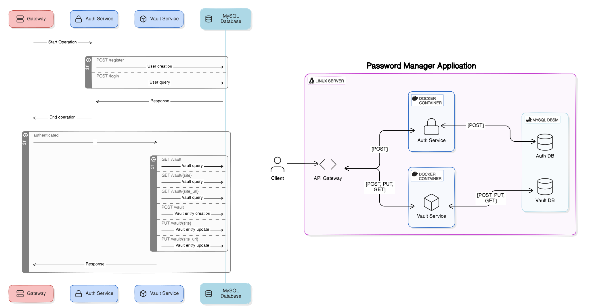

# Password Manager

This projects aims to build a web-based passoword manager. A pasword manager (From now on, PM) is an application that permits users store their credentials in a secure fashion without the need of remembering each one of their passwords. The PM can be acceded by the user using a master password (The only credential that the user must remember), and then he can either add more entries to his/her vault or query their credentials to use them in the site the want.

## Project Requirements

A PM has certain standard requirements that we must address in order to succesfully deploy a trusthworty application.

### Functional requirements

1. Web interface: The application must have a web interface where the users can access their dedicated password managers.
2. Automatic clipboard: The application must copy the desired password directly to the user's clipboard to avoid showing the password and forcing the user to manually copy it.
3. Password autogeneration: The application must provide a way to generate standarized secure passwords for the websites.

### Non-Functional requirements:

1. Consistency: The data transmitted across the application and the end-user must remain intact.
2. Reliability: The information must be securely stored within the application's database.
3. Security: The application must manage user's information carefully, and all security standards must be in place to avoid data leaks.
4. Portability: The application must be accesible through any web browser.

## Security concerns

A web-based PM has a particular sets of security concerns that we must have in mind before diving into the development and deployment.

### Password storage

User's credentials will be stored in a MySQL database. We must ensure that each password follows the next guidelines:

- The password manager must be accessed using a master password. We are not required to store this password in the system, so it is important to save only the password hash to validate the user.
- Users' passwords must not be stored in the database in plaintext. Since we want to retrieve the original password, store the password encrypted.	
- Implement strong salting to each stored password.
- Avoid the use of `random()` in Python. Instead, it is important to use the `secrets` library for this purpose.
- Application authentication (Master passwords and users) and users' passwords must be separated in different databases.

[OWASP Cryptographic storage](https://cheatsheetseries.owasp.org/cheatsheets/Cryptographic_Storage_Cheat_Sheet.html)
[OWASP Password storage cheat sheet](https://owasp.deteact.com/cheat/cheatsheets/Password_Storage_Cheat_Sheet.html)

### Password hashing and password salting

- For symmetric encryption, AES with a key that is at least 128 bits (ideally 256 bits).
- For asymmetric encryptin, ECC (Elliptical Curve Cryptography) with a secure curve such as Curve25519 is a good candidate. If not available, RSA is the second option, with a key that is at least 2048 bits.
- For hashing, SHA-256 is the recommended algorithm by NIST. However, modern algorithms like Argon2id or Bcrypt already hash and salt the information, which makes it easier to implement.

[OWASP Cryptographic storage](https://cheatsheetseries.owasp.org/cheatsheets/Cryptographic_Storage_Cheat_Sheet.html)
[OWASP Password storage](https://cheatsheetseries.owasp.org/cheatsheets/Password_Storage_Cheat_Sheet.html)

## Tech-stack

The following technology will be used to build the application.

### Backend

For its ease of use, the backend will be built mainly in Python. Some libraries like crypto will be used to address cryptography concerns. The Database Management System (DBMS) choosen for this project will be MySQL, which will be used to store the credentials in the authentication methods and in to store the user's credentials.

### Frontend

The Frontend will be developed using Typescript to ensure consistency and reduce bugs in the application.

### Command Line

The application will provide access via terminal.

## How to contribute?

Follow the next steps to contribute to the application development:

1. **Clone the repository**: Use `git clone https://github.com/AzJRC/password_manager` in your local machine to clone the files.
2. **Do your modifications**: Make the changes you propose.
	- Try to structurize your code and your files accordingly. Each module must be within the src directory within a folder with a descriptive, not too long name. *Name your files in lowercase and with underscores (_) instead of spaces*.
	- Use a virtual environment everytime you want to create a new module or modify an existing one. Use `python3 -m venv venv` to create a new virtual environment. Use `pip install -r requirements.txt` in a module with a virtual environment to install all the prerequisites for that part of the program.
	- I strongly suggest to include a `README.md` file in a new module. If you modify an existing module, be sure to include your changes in the `README.md` file if necessary.
	- Before commiting, ensure that you are in a branch with your name. Also, review your code before pushing it. It is required to implement testing actions (With `pytest`) before uploading your code. Also, it is required to include a descriptive commit message in past-tense.
	- Once you push your changes, select a reviewer. I suggest select the repository owner as the reviewer.
	- Wait for approval. If not approved, you may need to change your code accordingly to the reviewer.
3. **Pulling**: Everytime you may want to update your local branch, use `git pull --rebase` to avoid having a unreliable untrusted git history. If you notice a merge conflict when pulling the code with rebase, use `git rebase --abort` and then run `git pull`. Rebasing rewrites the commit history by moving or "replaying" your local commits on top of the latest commits from the target branch (typically the main branch). This results in a linear, cleaner commit history.
 
